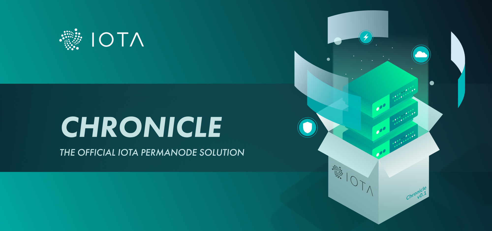

<h1 align="center">
  <br>
  <a href="https://docs.iota.org/docs/chronicle/1.1/overview"></a>
</h1>

<h2 align="center">A framework for building IOTA permanodes</h2>

<p align="center">
    <a href="https://docs.iota.org/docs/chronicle/1.1/overview" style="text-decoration:none;">
    
</p>
<p align="center">
    <a href="https://github.com/iotaledger/chronicle.rs/actions" style="text-decoration:none;"></a>
    <a href="https://github.com/iotaledger/chronicle.rs/actions" style="text-decoration:none;"></a>
    <a href="https://discord.iota.org/" style="text-decoration:none;"></a>
    <a href="https://iota.stackexchange.com/" style="text-decoration:none;"></a>
    <a href="https://github.com/iotaledger/chronicle.rs/blob/master/LICENSE" style="text-decoration:none;"></a>
    <a href="https://dependabot.com" style="text-decoration:none;"></a>
</p>

<p align="center">
  <a href="#about">About</a> ◈
  <a href="#prerequisites">Prerequisites</a> ◈
  <a href="#getting-started">Getting started</a> ◈
  <a href="#api-reference">API reference</a> ◈
  <a href="#supporting-the-project">Supporting the project</a> ◈
  <a href="#joining-the-discussion">Joining the discussion</a> ◈
  <a href="#future-work">Future work</a>
  <a href="#LICENSE">LICENSE</a>
</p>

---

## About

Chronicle provides tools for building permanode solutions on an efficent runtime based on [tokio](https://docs.rs/crate/tokio). With Chronicle, you can:

- Store IOTA transactions in real time, using one or more [Scylla](https://www.scylladb.com/) clusters
- Search for all stored transactions, using an HTTP API
- Extend your own application with custom crates and configurations

Chronicle includes the following crates that you can use as tools for building your own permanode and extending its functionality:

- **[API](chronicle-api/README.md):** API app that allows you to access the database
- **[Broker](chronicle-broker/README.md):** ZMQ broker app for subscribing to new and confirmed transactions on an IOTA node
- **[Common](chronicle-common/README.md):** Runtime code that handles the loading and shutting down of apps
- **[CQL](chronicle-cql/README.md):** Code for decoding and encoding Cassandra Query Language (CQL) commands for interacting with a Scylla node
- **[Storage](chronicle-storage/README.md):** Storage app for connecting to a Scylla node, storing transactions on it, and searching for them

**Note:** This is alpha software, so there may be performance and stability issues. Please report any issues in our [issue tracker](https://github.com/iotaledger/chronicle.rs/issues/new).

## Prerequisites

To run Chronicle, you need the following:

- A Linux LTS operating system such as [Ubuntu](https://ubuntu.com/download#download)

- 4 GB RAM

- 64-bit processor

- At least 2 CPU cores

    You can check how many CPU cores your device has, using the following command:

    ```bash
    nproc
    ```

- [Rust](https://www.rust-lang.org/tools/install)

- At least one Scylla node. See the [Scylla documentation](https://docs.scylladb.com/getting-started/) for a tutorial on setting one up.

- The `build-essentials`, `pkg-config`, and `libzmq3-dev` packages

    You can install these packages, using the following command:

    ```bash
    sudo apt update && sudo apt install build-essentials sudo apt install pkg-config && sudo apt install -y --no-install-recommends libzmq3-dev
    ```

- (Optional) An IDE that supports Rust autocompletion. We recommend [Visual Studio Code](https://code.visualstudio.com/Download) with the [rust-analyzer](https://marketplace.visualstudio.com/items?itemName=matklad.rust-analyzer) extension

- If you want to load historical transactions into your permanode, you can download the files from the [IOTA Foundation's archive](https://dbfiles.iota.org/?prefix=mainnet/history/).

We also recommend updating Rust to the latest stable version:

```bash
rustup update stable
```

## Installation

To build your own permanode, you need to add the crates as dependancies in your `Cargo.toml` file.

Because these crates are not available on crates.io, you need to use the Git repository either remotely or locally.

**Remote**

Add the following to your `Cargo.toml` file:

```bash
[dependencies]
chronicle-common = { git = "https://github.com/iotaledger/chronicle.rs" }
chronicle-api = { git = "https://github.com/iotaledger/chronicle.rs" }
chronicle-broker = { git = "https://github.com/iotaledger/chronicle.rs" }
chronicle-storage = { git = "https://github.com/iotaledger/chronicle.rs" }
```

**Local**

Clone this repository:

```bash
git clone https://github.com/iotaledger/chronicle.rs
```

Add the following to your `Cargo.toml` file:

```bash
[dependencies]
chronicle-common = { version = "0.1.0", path = "../chronicle.rs" }
chronicle-api = { version = "0.1.0", path = "../chronicle.rs" }
chronicle-broker = { version = "0.1.0", path = "../chronicle.rs" }
chronicle-storage = { version = "0.1.0", path = "../chronicle.rs" }
```

## Getting started

For examples of building your own permanode, see the examples in the [`broker`](examples/broker/main.rs) and [`storage`](examples/storage/main.rs) directories.

To get a permanode up and running as quickly as possible, run the CLI application by doing the following:

1. Clone and build Chronicle

  ```bash
  git clone https://github.com/iotaledger/chronicle.rs.git
  cd chronicle.rs
  cargo build
  ```

2. Run the `permanode` example

  ```bash
  cd examples
  cargo run --example permanode
  ```

For a complete tutorial on the permanode CLI, see the [documentation portal](https://docs.iota.org/docs/chronicle/1.1/tutorials/run-a-permanode).

## API reference

For an API reference, see the [documentation portal](https://docs.iota.org/docs/chronicle/1.1/references/chronicle-api-reference).

## Supporting the project

If you want to contribute to Chronicle, consider posting a [bug report](https://github.com/iotaledger/chronicle.rs/issues/new?template=bug-report-for-chronicle.md), [feature request](https://github.com/iotaledger/chronicle.rs/issues/new?template=feature-request-for-chronicle.md) or a [pull request](https://github.com/iotaledger/chronicle.rs/pulls).

Please read the following before contributing:

- [Contributing guidelines](.github/CONTRIBUTING.md)

## Joining the discussion

If you want to get involved in the community, need help with getting set up, have any issues related to Chronicle, or just want to discuss IOTA, Distributed Registry Technology (DRT) and IoT with other people, feel free to join our [Discord](https://discord.iota.org/).

## Future work

- Add more examples and documentation
- Add more test cases
- Add more field tests
- Allow Chronicle to solidify transactions
- Implement selective permanode
- Add dashboard web app
- Improve framework

## LICENSE

(c) 2019 - IOTA Stiftung

IOTA Chronicle is distributed under the Apache License (Version 2.0).
