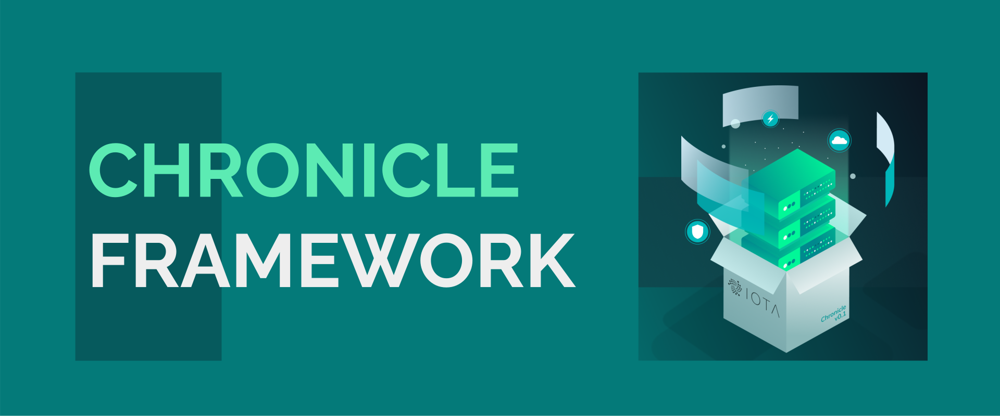

<h1 align="center">
   
  
</h1>

<h2 align="center">A framework for building Data driven and distributed systems</h2>

    <a href="https://docs.iota.org/docs/chronicle/1.1/overview" style="text-decoration:none;">
    

    
    
    
    
    
    

  <a href="#about">About</a> ◈
  <a href="#prerequisites">Prerequisites</a> ◈
  <a href="#getting-started">Getting started</a> ◈
  <a href="#supporting-the-project">Supporting the project</a> ◈
  <a href="#joining-the-discussion">Joining the discussion</a> ◈
  <a href="#future-work">Future work</a>
  <a href="#LICENSE">LICENSE</a>

---

## About

## Prerequisites

## Installation

## Getting started

## Supporting the project

If you want to contribute to Chronicle, consider posting a [bug report](https://github.com/iotaledger/chronicle.rs/issues/new?template=bug-report-for-chronicle.md), [feature request](https://github.com/iotaledger/chronicle.rs/issues/new?template=feature-request-for-chronicle.md) or a [pull request](https://github.com/iotaledger/chronicle.rs/pulls).

Please read the following before contributing:

- [Contributing guidelines](.github/CONTRIBUTING.md)

## Joining the discussion

If you want to get involved in the community, need help with getting set up, have any issues related to Chronicle, or just want to discuss IOTA, Distributed Registry Technology (DRT) and IoT with other people, feel free to join our [Discord](https://discord.iota.org/).

## Future work

- Add more examples and documentation
- Add unit tests

## LICENSE

(c) 2020 - IOTA Stiftung

IOTA Chronicle is distributed under the Apache License (Version 2.0).
